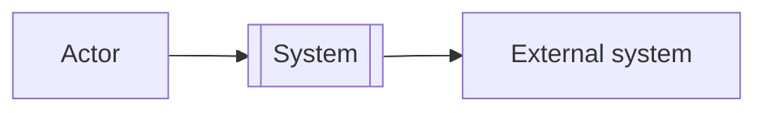
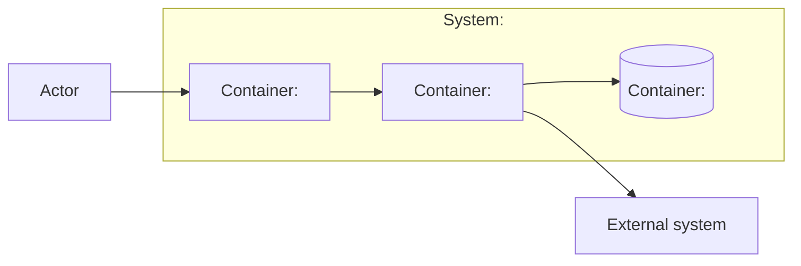
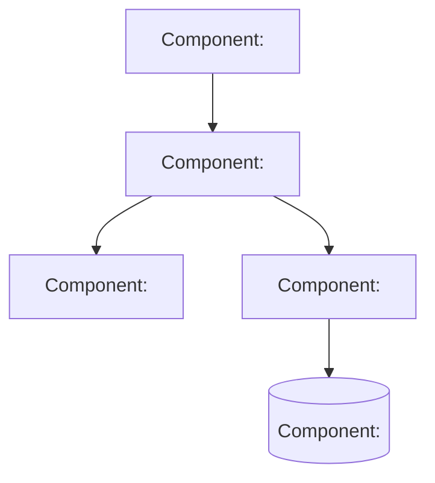
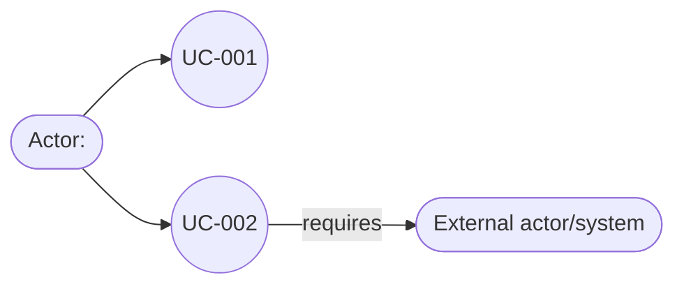
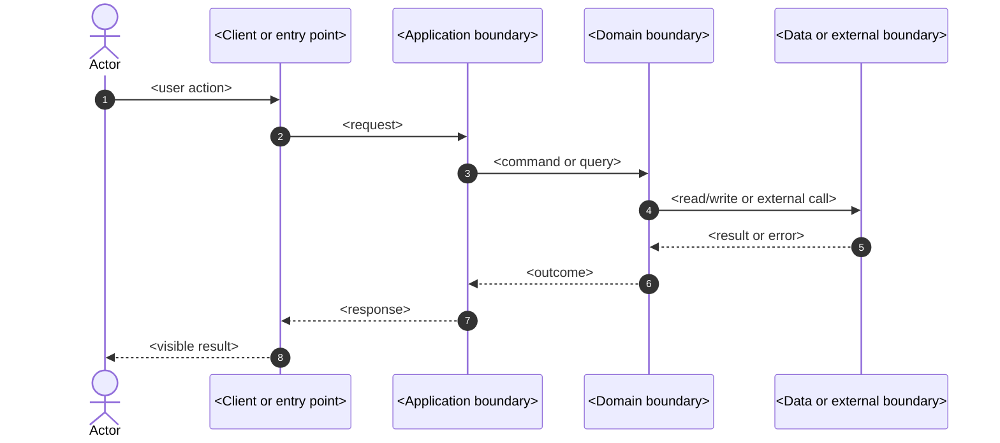
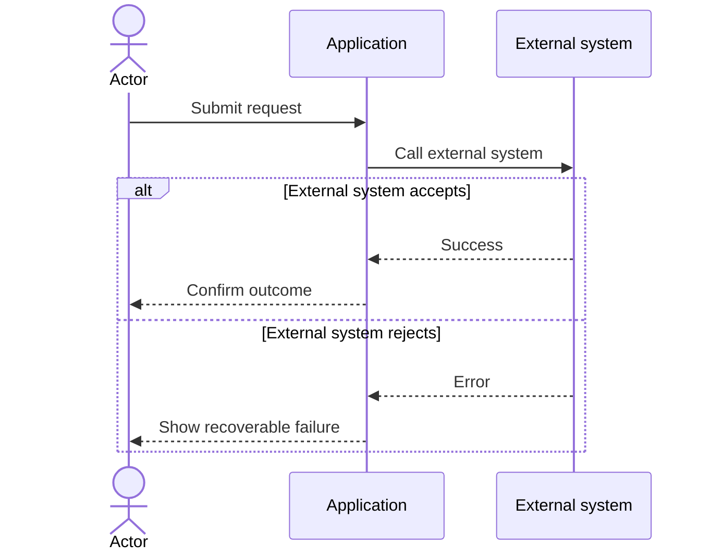

# Technical Specification Diagrams

Use this reference when generating the technical specification from an approved delivery map.

The diagrams are explanatory artifacts. They must remain traceable to the pitch, epic, user stories, requirements, and technical decisions. Use Mermaid fenced blocks unless the consuming project already requires another diagram format.

## Diagram evidence

Every diagram must declare:

- a stable diagram ID;
- a diagram type;
- a title;
- source requirement, story, or task IDs;
- a status: `VERIFIED`, `PROPOSED — TECHNICAL VALIDATION REQUIRED`, or `PENDING_DEFINITION`;
- assumptions and open decisions;
- a Mermaid source block.

Use `VERIFIED` only when the supplied evidence supports the node, boundary, relationship, or sequence. Use `PROPOSED — TECHNICAL VALIDATION REQUIRED` for an architecture recommendation. Use `PENDING_DEFINITION` when a required decision or fact is missing.

Do not invent service names, databases, protocols, vendors, actors, or deployment boundaries. Represent unknown items as `PENDING_DEFINITION` or `External system — identity pending`.

## Diagram set

Generate the smallest set that explains the specification. A normal feature specification should include:

1. **C4 System Context (C1)** — system boundary, actors, external systems, and major relationships.
2. **C4 Container (C2)** — applications, services, data stores, queues, or other deployable/runtime boundaries when the feature crosses them.
3. **Use-case map** — actors and the user goals supported by the feature.
4. **Sequence diagram** — one diagram for each critical user story or integration flow.

Add **C4 Component (C3)** only when a container is complex enough that its internal responsibilities affect the design, contracts, risks, or tasks. C4 Code diagrams are rarely needed; prefer code, tests, and prose.

## C4 System Context (C1)

Show:

- the person or actor;
- the system being specified;
- external systems or organizations;
- high-level relationships and protocols when known;
- the system boundary.

## C4 Container (C2)

Show only meaningful runtime boundaries. Label technology only when it is verified or clearly marked proposed.

If the technology is a proposal, write it in the caption or metadata, for example: `PROPOSED — TECHNICAL VALIDATION REQUIRED: PostgreSQL`.

## C4 Component (C3)

Use C3 for a complex container or critical boundary. Each component needs one responsibility and an explicit relationship to a source story, contract, or quality requirement.

Do not use C3 to guess the project's internal class structure. Generate it only when the structure is needed to explain a real design decision.

## Use-case map

Mermaid does not provide a consistently supported UML use-case renderer across all consumers. Use a focused flowchart and pair it with a use-case table.

Use-case table:

| ID | Actor | Goal | Source stories | Preconditions | Outcome |
|---|---|---|---|---|---|
| `UC-001` | `<specific actor>` | `<observable goal>` | `US-001` | `<condition>` | `<result>` |

Use cases describe goals and outcomes. They do not replace acceptance criteria or technical tasks.

## Sequence diagrams

Create a sequence diagram for each critical story, integration, failure path, or security-sensitive flow. Keep it focused on the participants and messages needed to explain the behavior.

Add alternate or error paths only when they affect requirements, security, data integrity, or acceptance criteria:

Each sequence must identify its source story or use case and state whether it is verified or proposed.

## Architecture proposal

When the specification requires a proposed architecture, include:

1. a short architecture decision statement;
2. C1 and C2 diagrams;
3. C3 only where complexity justifies it;
4. quality attributes affected;
5. alternatives considered;
6. risks and validation tasks;
7. explicit `PROPOSED — TECHNICAL VALIDATION REQUIRED` labels.

Do not present a C4 diagram as proof that the architecture already exists. A diagram can describe the current system, the proposed change, or both; its metadata must state which.

## Diagram quality gate

Before passing the technical specification:

- every diagram has an ID, type, title, status, and source IDs;
- C1 shows system context and boundaries;
- C2 shows only meaningful runtime or data boundaries;
- C3 is used only when it explains a complex or critical container;
- use cases identify actors and observable goals;
- critical stories and integrations have sequence diagrams;
- sequence participants and messages match the proposed contracts;
- dependencies and external calls are visible where they affect execution;
- Mermaid fences specify `mermaid`;
- proposal labels are present for unverified architecture;
- no diagram contradicts the source requirements or delivery map;
- open architecture decisions and validation tasks are recorded.

